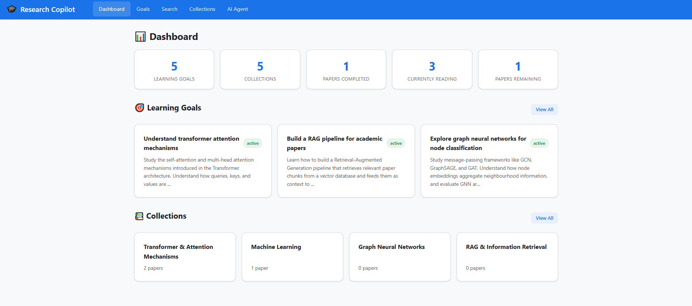
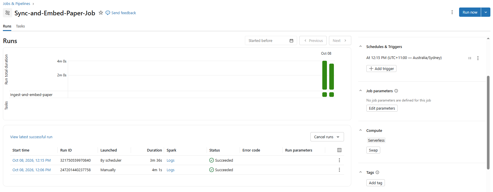

# AI Research & Learning Copilot
### Databricks Apps Powered by Lakebase, OpenAlex & MCP

An AI-powered platform for discovering academic papers, building personalized
study plans, and tracking research progress. Users create learning objectives,
discover relevant papers via semantic search and the OpenAlex API, save them
into collections, and ask an AI agent to summarize, compare, or recommend
papers.

## About This Project

This application is a submission for the **capstone project** in the [DataExpert.io](https://www.dataexpert.io)
program [The Rise of the AI Data Engineer](https://learn.dataexpert.io/program/the-one-week-beginners-databricks-boot-camp-7129).

All data is stored in **Databricks Lakebase Postgres** with **pgvector** for
semantic retrieval.

## Features

- **Learning Goals** — Create and track research learning objectives
- **Paper Discovery** — Semantic search over indexed papers + live OpenAlex search
- **Collections** — Organize papers into themed collections
- **Reading Progress** — Track what you've read, what you're reading, and what's next
- **Notes** — Take notes on individual papers
- **AI Agent Chat** — LLM-routed tool dispatch with 15 capabilities:
  search, summarize, compare, study plan, recommend, add to collection,
  update progress, general RAG, verify user, create collection,
  get reading progress, create learning goal, get learning goals,
  get collections, and get collection papers (with citations)
- **MCP Agent Tools** — 14 tools exposed via FastMCP for Agent Bricks
  integration (same capabilities as the Flask agent chat, minus general RAG)


## Architecture

The system has three parts that can be deployed and run independently:

1. **Data Ingestion & Embedding Pipeline** (`notebooks/ingest_and_embed_papers`) — runs on Databricks compute on a periodic basis.
2. **Agent Bricks MCP Server** (`mcp_server/`) — standalone Databricks App exposing 14 research tools over MCP
3. **Front-end Flask App** (`app.py` + `templates/`) — Databricks App serving the web UI and agent chat

Parts 1 and 3 share modules (`lakebase.py`, `openalex_client.py`, `research_tools.py`);
Part 2 is self-contained with its own backend logic in `research_broker.py`.

### Part 1 — Data Ingestion & Embedding Pipeline

The `notebooks/ingest_and_embed_papers` notebook runs on Databricks compute and serves as the project's data backbone. It is **goal-driven**: learning goals stored in Lakebase Postgres act as search terms for the OpenAlex API, so the paper index grows with what users actually want to learn. The pipeline operates in two modes — **initial seeding** (create schema, seed sample goals & notes, fetch papers, compute first embeddings) and **periodic refresh** (discover new papers matching existing goals, upsert metadata, and refresh the vector index). All other operations — searching, adding to collections, tracking reading progress — are handled at runtime by the Flask app and Agent Bricks agent. The diagram below shows the end-to-end flow:

```
┌─────────────────────────────────────────────────────────────┐
│  notebooks/ingest_and_embed_papers                          │
│  Paper Ingestion & Embedding Pipeline                       │
│                                                             │
│  Lakebase ── read ──▶ learning_goals (titles = search terms)│
│                              │                              │
│                              ▼                              │
│             OpenAlex API ── fetch ──▶ papers, authors       │
│                              │                              │
│                              ▼                              │
│          Upsert papers & authors to Lakebase Postgres       │
│                              │                              │
│                              ▼                              │
│                Chunk abstracts, notes & goals               │
│                              │                              │
│                              ▼                              │
│           Encode chunks with sentence-transformers          │
│                  (all-MiniLM-L6-v2, 384-dim)                │
│                              │                              │
│                              ▼                              │
│             Upsert embeddings to Lakebase pgvector          │
└─────────────────────────────────────────────────────────────┘
```

### Part 2 — Agent Bricks MCP Server

The `mcp_server/` folder is deployed as a standalone Databricks App that
exposes 14 research tools over the Model Context Protocol (MCP). It is designed
to work with a **Databricks Agent Bricks** agent, which acts as the
orchestration layer that interprets user intent, decides which tools to call,
and synthesizes natural-language responses from the results. The diagram
below shows the full request→response chain:

```
               ┌─────────────────┐
               │       User      │
               └────────┬────────┘
                   ▲    │
          Response │    │ Prompt
                   │    ▼
┌──────────────────┴────────────────────────────┐
│         Databricks Agent Bricks Agent         │
│  • Interprets user intent                     │
│  • Decides which MCP tool(s) to call          |
|  • Synthesizes answer                         │
└───────────────────────┬───────────────────────┘
                   ▲    │
         {status,  │    │ MCP tool call (HTTP)
          message, │    │
          data}    │    ▼
┌──────────────────┴──────────────────────────────┐
│               Research MCP Server               |
|        (research_mcp_server.py, FAST MCP)       |
│  14 @mcp.tool wrappers:                         │
│  • search_papers                                │
│  • summarize_papers                             │
│  • compare_papers                               │
│  • generate_study_plan                          │
│  • add_to_collection                            │
│  • create_collection                            │
│  • update_reading_progress                      │
│  • get_reading_progress                         │
│  • recommend_next_paper                         │
│  • verify_user                                  │
│  • create_learning_goal                         │
│  • get_learning_goals                           │
│  • get_collections                              │
│  • get_collection_papers                        │
└───────────────────────┬─────────────────────────┘
                   ▲    │
            Result │    │ Function call
                   │    ▼
┌──────────────────┴───────────────────────────────┐
│             Broker (research_broker.py)          |
|  Self-contained backend:                         |
│  • Lakebase connection + DB helpers              │
│  • pgvector cosine-similarity search             │
│  • sentence-transformers encoding                │
│  • LLM calls (summarize, compare, recommend)     │
│  • OpenAlex search + abstract reconstruction     │
└──────┬───────────────────┬──────────────────┬────┘
       │                   │                  │
       ▼                   ▼                  ▼
┌───────────────┐  ┌───────────────┐  ┌───────────────┐
│    Lakebase   │  │  Databricks   │  │   OpenAlex    │
│    Postgres   │  │     LLM       │  │     API       │
│    (CRUD,     │  │(Llama 3.3 70B)│  │   (papers,    │
│   pgvector)   │  │               │  │   authors)    │
└───────────────┘  └───────────────┘  └───────────────┘
```

**How it works (step by step):**

1. **User** sends a natural-language prompt to the **Agent Bricks Agent** (Databricks-hosted LLM)
2. **Agent Bricks Agent** interprets intent and
   decides which MCP tool(s) to call
3. **Agent** sends MCP tool call(s) over HTTP to the research MCP server **`research_mcp_server.py`**
   — the list of research tools
4. The selected tools then call the corresponding backend functions in
   **`research_broker.py`**
5. **`research_broker.py`** hits the external services as needed:
   - **Lakebase Postgres** — for CRUD queries and pgvector similarity search
   - **OpenAlex API** — for discovering new papers and fetch data (via `openalex_search()`)
   - **Databricks LLM** (Llama 3.3 70B) — for summarization, comparison,
     study plans, recommendations (via `call_llm()`)
6. Results bubble back up: `research_broker.py` →
   `research_mcp_server.py` (formatted as `{status, message, data}`) →
   **Agent Bricks Agent** (synthesizes response in natural language) → **User**

### Part 3 — Front-end Flask App with Agent Chat

The root-level `app.py` is deployed as a **Databricks App** serving both a
traditional web UI and an AI-powered agent chat. The **UI routes** (dashboard,
goals, search, collections, paper detail) talk directly to Lakebase Postgres
via `lakebase.py` for standard CRUD operations. The **`/api/agent/chat`**
endpoint adds an LLM layer on top: on first contact the chat UI asks for
the user's identity and the backend verifies it against the `users` table;
once verified, subsequent messages enter
`research_tools.dispatch()` — an LLM-based router that classifies intent,
picks one of 15 tool functions, extracts parameters, and returns structured
results with citations. The diagram below shows both paths:

```
                         ┌──────────────────┐
                         │  User (Browser)  │
                         └────────┬─────────┘
                                  │
                                  ▼
                       ┌──────────────────────┐
                       │  app.py (Flask App)  │
                       │    Databricks App    │
                       └──────┬──────┬────────┘
                              │      │
               ┌──────────────┘      └──────────┐
               │  UI routes                     │  /api/agent/chat
               │  (goals, search,               │
               │   collections,                 │
               │   paper detail)                │
               │                                ▼
               │                    ┌────────────────────────┐
               │                    │  Session verify gate   │
               │                    │  (user ID or email)    │
               │                    └───────────┬────────────┘
               │                                │
               │                                ▼
               │                    ┌────────────────────────┐
               │                    │    research_tools.py   │
               │                    │  ┌──────────────────┐  │
               │                    │  │    dispatch()    │  │
               │                    │  │  LLM classifies  │  │
               │                    │  │  user intent →   │  │
               │                    │  │  picks tool →    │  │
               │                    │  │  extracts params │  │
               │                    │  └────────┬─────────┘  │
               │                    │           │            │
               │                    │           ▼            │
               │                    │  ┌──────────────────┐  │
               │                    │  │ 15 Tool Funcs:   │  │
               │                    │  │ search_papers    │  │
               │                    │  │ summarize        │  │
               │                    │  │ compare          │  │
               │                    │  │ study_plan       │  │
               │                    │  │ recommend        │  │
               │                    │  │ add_to_coll.     │  │
               │                    │  │ update_progress  │  │
               │                    │  │ general_rag      │  │
               │                    │  │ verify_user      │  │
               │                    │  │ create_coll.     │  │
               │                    │  │ get_progress     │  │
               │                    │  │ create_goal      │  │
               │                    │  │ get_goals        │  │
               │                    │  │ get_collections  │  │
               │                    │  │ get_coll_papers  │  │
               │                    │  └──────────────────┘  │
               │                    └─┬─────────────────────┬┘
               │                      │                     │
               ▼                      ▼                     ▼
       ┌──────────────┐       ┌──────────────┐    ┌──────────────────┐
       │  lakebase.py │       │  lakebase.py │    │openalex_client.py│
       └───────┬──────┘       └───────┬──────┘    └─────────┬────────┘
               │                      │                     │
               ▼                      ▼                     ▼
      ┌─────────────────┐    ┌─────────────────┐ ┌─────────────────────┐
      │    Lakebase     │    │    Lakebase     │ │    External APIs    │
      │    Postgres     │    │    Postgres     │ │  • OpenAlex API     │
      │  (CRUD queries) │    │   (pgvector)    │ │  • Databricks LLM   │
      └─────────────────┘    └─────────────────┘ │   (Llama 3.3 70B)   │
                                                 └─────────────────────┘
```


<p align="center">
  <br>
  <em>Figure 1: Homepage of the "Research Copilot" Flask app</em>
</p>


**How it works (step by step):**

1. **User** opens the Flask app in a browser and lands on one of the
   **UI routes** (dashboard, goals, search, collections, paper detail)
   or the `/agent` chat page
2. **UI routes** query Lakebase Postgres directly via **`lakebase.py`** for
   CRUD operations (create goals, search papers, manage collections, track
   progress)
3. On the **agent chat** page, `agent.html` greets the user with a
   verification prompt; the user's first message is treated by
   `/api/agent/chat` as a user ID or email/name lookup against the `users`
   table
4. Once verified, subsequent messages are forwarded to
   **`research_tools.dispatch(user_msg, user_id)`**
5. **`dispatch()`** calls the **LLM** with a routing prompt to classify
   intent, pick one of 15 tool functions, and extract parameters
   (e.g. "find papers on transformers" → `search_papers`)
6. The chosen **tool function** executes, hitting one or more backends:
   - **`lakebase.py`** for CRUD queries and pgvector similarity search
   - **`openalex_client.py`** for live paper discovery from OpenAlex
   - **Databricks LLM** (Llama 3.3 70B) for summarization, comparison,
     and recommendations
7. Results bubble back up: tool function →
   `research_tools.dispatch()` (formatted as `{tool, answer, citations}`)
    → **`app.py`** → rendered in `agent.html` with a tool badge and source
    links

## Agent Capabilities

The Flask agent chat and the MCP server share 14 of 15 tools. Both
interfaces support the same capabilities except for `general_rag`
(Flask only):

| Tool | Type | Description | Flask | MCP |
| --- | --- | --- | --- | --- |
| `search_papers` | Read | Find papers by semantic search or OpenAlex | ✓ | ✓ |
| `summarize_papers` | Read | LLM summary of papers with citations | ✓ | ✓ |
| `compare_papers` | Read | Side-by-side comparison of two papers | ✓ | ✓ |
| `generate_study_plan` | Read | Sequenced reading plan from foundational to advanced | ✓ | ✓ |
| `recommend_next_paper` | Read | Suggest next paper based on study plan, learning goals, and reading history | ✓ | ✓ |
| `add_to_collection` | Write | Add a paper to a user's collection | ✓ | ✓ |
| `update_reading_progress` | Write | Mark a paper as reading/completed | ✓ | ✓ |
| `general_rag` | Read | Answer any question via RAG over the paper database | ✓ | — |
| `verify_user` | Read | Check that a user exists before user-scoped actions | ✓ | ✓ |
| `create_collection` | Write | Create a new paper collection | ✓ | ✓ |
| `get_reading_progress` | Read | Retrieve reading progress history | ✓ | ✓ |
| `create_learning_goal` | Write | Add a learning goal and create its embedding | ✓ | ✓ |
| `get_learning_goals` | Read | Retrieve all learning goals for a user | ✓ | ✓ |
| `get_collections` | Read | Retrieve all collections for a user | ✓ | ✓ |
| `get_collection_papers` | Read | Retrieve all papers in a collection | ✓ | ✓ |

The Flask agent chat uses `research_tools.dispatch()` — an LLM-based router
that classifies user intent, picks the right tool, extracts parameters, and
returns `{tool, answer, citations}`. The MCP server exposes 14 `@mcp.tool`
endpoints with the `{status, message, data}` contract for Agent Bricks.
Both interfaces share 14 of the same tools; the Flask agent additionally
exposes `general_rag` as a RAG-based fallback for open-ended questions.

> **See it in action:** [`DEMONSTRATION.md`](./mcp_server/DEMONSTRATION.md)
> contains 15 example queries with full agent responses, tool calls, and JSON
> outputs that demonstrate every agent capability — from semantic search and
> study plan generation to collection management and reading progress tracking.


## Project Structure

```
AI-Research-and-Learning-Copilot/
├── notebooks/                        # Part 1 — Data Ingestion & Embedding Pipeline
│   └── ingest_and_embed_papers      #   Spark notebook (entry point)
├── mcp_server/                       # Part 2 — Agent Bricks MCP Server (standalone)
│   ├── AGENT_SYSTEM_PROMPT.md       #   Agent Bricks system prompt
│   ├── DEMONSTRATION.md              #   15 example queries & agent responses
│   ├── app.yaml                      #   Deployment config (entry: research_mcp_server.py)
│   ├── requirements.txt              #   MCP server dependencies
│   ├── research_broker.py            #   Self-contained backend (DB, vector, LLM, OpenAlex)
│   └── research_mcp_server.py        #   14 @mcp.tool wrappers (per-tool user verification)
├── templates/                        # Part 3 — Front-end Flask App (templates)
│   ├── base.html                     #   Base layout + CSS design system
│   ├── index.html                    #   Dashboard (stats, goals, collections)
│   ├── goals.html                    #   Learning goals management
│   ├── search.html                   #   Paper search (semantic + OpenAlex)
│   ├── collections.html              #   Collections list
│   ├── collection.html               #   Collection detail
│   ├── paper.html                    #   Paper detail (notes, progress)
│   └── agent.html                    #   AI agent chat interface
├── tests/                            # Testing — Smoke, dry-run, and integration tests
│   ├── smoke_test.py                 #   Verifies secrets, DB, HNSW index, vector search
│   ├── test_openalex_dry_run.py      #   Validates OpenAlex normalization fields
│   └── test_tools_integration.py     #   Tests add_to_collection, recommend_next_paper, progress chaining
├── app.py                            # Part 3 — Flask app (entry point, 15+ routes)
├── app.yaml                          # Part 3 — Flask app deployment config
├── job-config.json                   # Scheduling — Lakeflow Job for periodic pipeline refresh
├── requirements.txt                  # Part 3 — Flask app dependencies
├── research_tools.py                 # Shared — 15 tools + dispatcher (Parts 1 & 3)
├── lakebase.py                       # Shared — Lakebase Postgres connection (Parts 1 & 3)
├── openalex_client.py                # Shared — OpenAlex API client (Parts 1 & 3)
├── setup_secrets.py                  # Setup — Secret scope + key provisioning
├── setup_database.sql                # Setup — 10-table schema with pgvector
└── README.md                         # This file
```

## Database Schema

10 tables in Lakebase Postgres with pgvector (`VECTOR(384)`, HNSW cosine
index, `m=16`, `ef_construction=64`):

| Table | Key Columns | FK References | Purpose |
| --- | --- | --- | --- |
| `users` | `user_id` (PK, BIGSERIAL), `email` (UNIQUE) | — | User accounts (seed demo user) |
| `learning_goals` | `goal_id` (PK), `user_id`, `title`, `status` | `user_id` → `users` | Research learning objectives per user |
| `papers` | `paper_id` (PK, OpenAlex ID), `title`, `cited_by_count` | — | Paper metadata from OpenAlex |
| `authors` | `author_id` (PK, OpenAlex ID), `display_name` | — | Author information |
| `paper_authors` | `paper_id`, `author_id`, `position` | `paper_id` → `papers`, `author_id` → `authors` | Many-to-many paper ↔ author |
| `collections` | `collection_id` (PK), `user_id`, `name` | `user_id` → `users` | User paper collections |
| `collection_papers` | `collection_id`, `paper_id`, `notes` | `collection_id` → `collections`, `paper_id` → `papers` | Many-to-many collection ↔ paper |
| `reading_progress` | `user_id`, `paper_id`, `status`, `completed_at` | `user_id` → `users`, `paper_id` → `papers` | Per-user reading status (`not_started` / `reading` / `completed`) |
| `notes` | `note_id` (PK), `user_id`, `paper_id`, `content` | `user_id` → `users`, `paper_id` → `papers` | User notes on papers |
| `embeddings` | `id` (PK), `source_type`, `embedding` (VECTOR 384) | — | pgvector embeddings for abstracts, notes, and goals |


## Tech Stack

- **Flask** — Web framework and REST API
- **Databricks Lakebase Postgres** — Managed Postgres with pgvector
- **OpenAlex API** — Academic paper metadata, abstracts, authors, citations
- **sentence-transformers/all-MiniLM-L6-v2** — Embedding model (384-dim)
- **pgvector** — HNSW-indexed vector similarity search
- **Databricks Foundation Models** — LLM for RAG summaries (Meta Llama 3.3 70B)
- **FastMCP** — MCP server for Agent Bricks integration
- **Databricks Apps** — Hosting platform

## Prerequisites

1. **Databricks Lakebase Postgres** instance with pgvector extension
2. **Databricks workspace** with Apps and Foundation Model access
3. **Python 3.10+**

## Setup Instructions

### Shared Prerequisites

1. **Configure secrets** — Create the `research_copilot` secret scope:
   ```bash
   python setup_secrets.py
   ```
   This stores:
   - `lakebase-url` — Lakebase Postgres connection URL
   - `openalex-api-key` — OpenAlex API key (optional but recommended)
   - `openalex-email` — Email for OpenAlex polite pool (optional)

2. **Create database schema** — Run `setup_database.sql` in the Lakebase SQL Editor
   to create all 10 tables, the pgvector extension, HNSW index, and seed demo user.

### Part 1: Run the Data Ingestion & Embedding Pipeline

Open and run `notebooks/ingest_and_embed_papers` to:
- Initialise the database schema and seed sample learning goals & notes
- Fetch papers from OpenAlex for each learning goal in the database
- Upsert papers, authors, and paper-author relationships to Lakebase
- Chunk paper abstracts, user notes, and learning goals
- Compute 384-dim embeddings with sentence-transformers
- Upsert embeddings into pgvector

#### Scheduling the Pipeline (Optional)

A Lakeflow Jobs configuration is included in `job-config.json` for production
scheduling of the periodic refresh mode.  To create the job:

```bash
databricks jobs create --json-file job-config.json
```

This schedules a daily run at 12:15 PM Australia/Sydney time (UTC+11:00)
that re-discovers papers from OpenAlex matching existing learning goals and
refreshes the vector index.
Adjust the `notebook_path` in the JSON to match your workspace path.

<p align="center">
  <br>
  <em>Figure 2: Notebook scheduled to fetch papers and refresh embeddings on daily basis</em>
</p>

### Part 2: Deploy the MCP Server (optional, for Agent Bricks)

The `mcp_server/` folder is a self-contained Databricks App. Deploy it
separately:

```bash
databricks apps create research-copilot-mcp --source-code-path ./mcp_server
databricks apps deploy research-copilot-mcp
databricks apps start research-copilot-mcp
```

Then register the MCP server URL in your Agent Bricks agent configuration
using `mcp_server/AGENT_SYSTEM_PROMPT.md` as the system prompt.

### Part 3: Deploy the Flask App

```bash
databricks apps create research-copilot --source-code-path ./
databricks apps deploy research-copilot
databricks apps start research-copilot
```

## Testing

Three test scripts are included under `tests/` to validate the infrastructure
and API integrations:

### Smoke Test

Verifies that secrets are accessible, Lakebase Postgres is reachable, all
10 required tables exist, the HNSW vector index is present, and a sample
vector search returns results.

```bash
python tests/smoke_test.py
```

### OpenAlex Dry-Run Test

Validates that the OpenAlex API is reachable and that the normalization
logic in `openalex_client.py` produces records with all expected fields
(`paper_id`, `title`, `abstract`, `publication_date`, `cited_by_count`,
`doi`, `source_name`, `pdf_url`, `openalex_url`, `concepts`, `authorships`).
Also tests abstract reconstruction, the `search_papers_for_goal`
convenience method, and single-work fetch by ID.

```bash
python tests/test_openalex_dry_run.py
```

### Tool Integration Tests

Tests key tool functions against the live Lakebase database:
- `add_to_collection` creates a reading-progress seed record
- `recommend_next_paper` respects the user's reading history
- `update_reading_progress` chains a recommendation when status=completed
- `update_reading_progress` does NOT chain when status=reading

```bash
python tests/test_tools_integration.py
```

All three test scripts exit with code 0 on success and 1 on failure, making
them suitable for CI/CD pipelines or pre-deployment validation.

## Environment Variables

Configured in `app.yaml`:

| Variable | Default | Purpose |
| --- | --- | --- |
| `RESEARCH_SECRET_SCOPE` | `research_copilot` | Databricks secret scope name |
| `LAKEBASE_SECRET_URL` | `lakebase-url` | Secret key for the Lakebase connection URL |
| `OPENALEX_API_KEY_SECRET` | `openalex-api-key` | Secret key for the OpenAlex API key |
| `OPENALEX_EMAIL_SECRET` | `openalex-email` | Secret key for the OpenAlex polite-pool email |
| `LLM_MODEL` | `databricks-meta-llama-3-3-70b-instruct` | Serving endpoint for LLM calls |
| `EMBEDDING_MODEL_NAME` | `sentence-transformers/all-MiniLM-L6-v2` | Embedding model for vector search |

## Acknowledgments

- [DataExpert.io](https://www.dataexpert.io) — Capstone program curriculum and mentorship
- [OpenAlex](https://openalex.org) — Open scholarly metadata API powering paper discovery
- [Databricks](https://www.databricks.com) — Lakebase Postgres, Foundation Models, Apps, and Agent Bricks platform
- [sentence-transformers](https://www.sbert.net) — Embedding model framework
- [pgvector](https://github.com/pgvector/pgvector) — Vector similarity search for Postgres
- [FastMCP](https://github.com/jlowin/fastmcp) — Model Context Protocol server framework

## License

This project is licensed under the MIT License — see the [LICENSE](./LICENSE) file for details.


